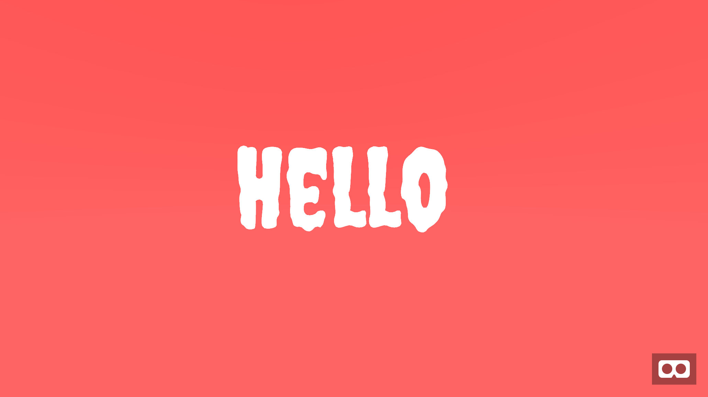

# A-Frame Fonts 📖

Fonts are important, by default A-Frame only ships with a few.
Not anymore. In this repo you will find all the fonts from Google Fonts converted into a MSDF format supported by A-Frame.
There are more than 2000 of them...😂



## Demo

#### [👉👉 Live demo 😎 👈👈](https://etiennepinchon.github.io/aframe-fonts/)

## Getting Started

To use those fonts simply create a text entity with the attribute `font` and `shader: msdf;` (very important).

```html
<a-entity text="value:Hello; color:#FFFFFF; shader: msdf; font:https://raw.githubusercontent.com/etiennepinchon/aframe-fonts/master/fonts/creepster/Creepster-Regular.json;" position="6.7 1 -2"></a-entity>     
```

All the fonts can be served using this template:
```
https://raw.githubusercontent.com/etiennepinchon/aframe-fonts/master/fonts/[FONT_NAME]/[FONT_TYPE].json
```

Note that if you wish to download the font files, make sure you have both the .json and .png. A-Frame will automatically import the .png file.


## Want to make some changes to it?

### Installation

First make sure you have Node installed.

On Mac OS X, it's recommended to use [Homebrew](http://brew.sh/) to install Node + [npm](https://www.npmjs.com):

    brew install node

This project uses [msdf-bmfont](https://www.npmjs.com/package/msdf-bmfont), and some of its dependencies must be installed in advance. For system-specific installation view the [node-canvas wiki](https://github.com/Automattic/node-canvas/wiki/_pages). You can quickly install the dependencies by using the command for your OS:

OS | Command
----- | -----
OS X | `brew install pkg-config cairo libpng jpeg giflib`
Ubuntu | `sudo apt-get install libcairo2-dev libjpeg8-dev libpango1.0-dev libgif-dev build-essential g++`
Fedora | `sudo yum install cairo cairo-devel cairomm-devel libjpeg-turbo-devel pango pango-devel pangomm pangomm-devel giflib-devel`
Solaris | `pkgin install cairo pkg-config xproto renderproto kbproto xextproto`
Windows | [Instructions on the node-canvas wiki](https://github.com/Automattic/node-canvas/wiki/Installation---Windows)

If this doesn't work, refer to the [msdf-bmfont installation instructions](https://www.npmjs.com/package/msdf-bmfont#install).

To install the Node dependencies:

    npm install

### Local Development

To serve the site from a simple Node development server:

    npm start

Then launch the site from your favorite browser:

[__http://localhost:3000/__](http://localhost:3000/)

## License

Distributed under an [MIT License](LICENSE).

Note that all those fonts are subject to copyrights. 
Make sure to have a look at [Google Fonts README](/legal/README.md).

Made by Etienne Pinchon (@etiennepinchon) - October 2017.
